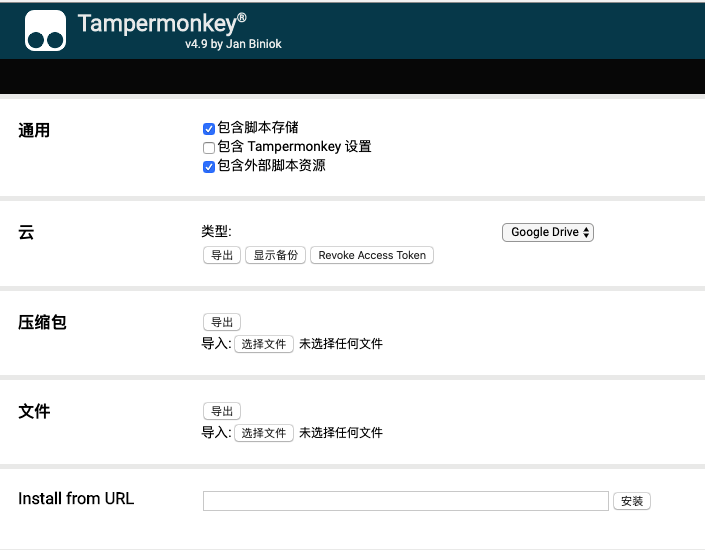
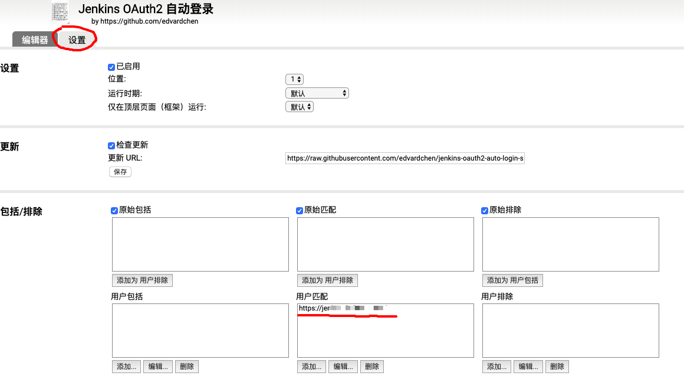

# jenkins-oauth2-auto-login-script

tampermonkey script to stay logged in self-host jenkins

当你们团队或者公司部署的 Jenkins，要求你们通过 OAuth2 登录，但是又没有实现自动刷新 token，默认 `access_token` 将在一小时内失效，开发者经常要重新登录。

`jenkins-oauth2-auto-login-script` 通过刷新页面，检测当前登录状态来完成自动登录。

## Usage

1. 安装扩展程序 [Tampermonkey](https://chrome.google.com/webstore/detail/tampermonkey/dhdgffkkebhmkfjojejmpbldmpobfkfo)
2. 点击扩展程序 `Tampermonkey`，选择`管理面板 -> 实用工具 -> Install from URL`，填入

   ```bash
   https://raw.githubusercontent.com/edvardchen/jenkins-oauth2-auto-login-script/master/lib/index.js
   ```

   

3. 设置公司部署的 jenkins 地址

   

4. 打开上述的地址，不要关闭这个页面（inactive 没关系），我们可以固定标签页或者单独开一个 chrome window 并且最小化。
   日常我们打开新的 jenkins 页面操作。

   
